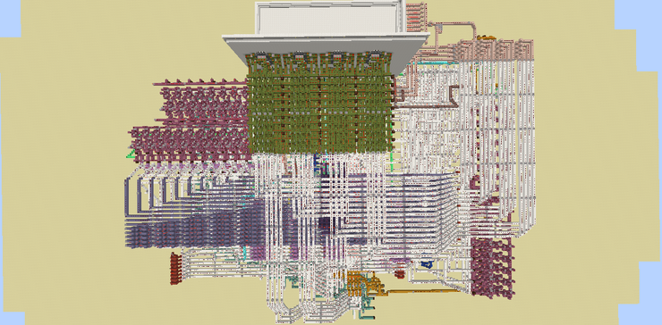
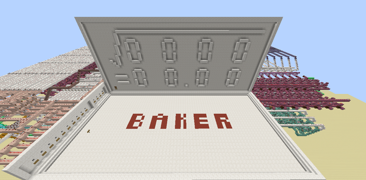
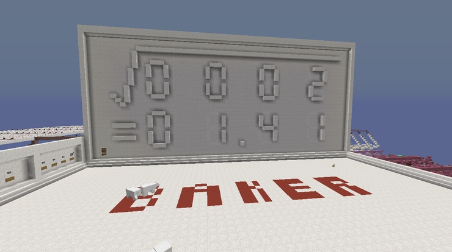
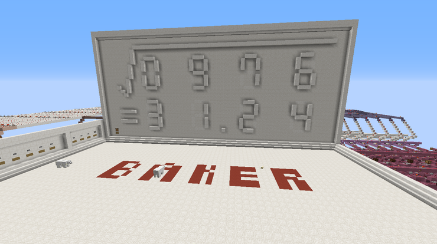

# Minecraft Square root Calculator

Square root Calculator in Minecraft.  
The project was completed on July 12, 2016.

Video: https://youtu.be/HvhP6PfT-PQ

## Features
- The algorithm used to calculate the square root value is "[long division method](https://www.google.com/search?q=square+root+long+division+method)", in korean "[개평법](https://namu.wiki/w/%EC%84%B8%EB%A1%9C%EC%85%88%EB%B2%95#s-2.2.1)"
- My own conversion algorithm was used to convert numbers between Binary and BCD: [Video](https://youtu.be/nwZJh3b39Bg)
- Sequential Logic Circuit (It takes around 5 minutes to calculate one value)
- input(0~1024), output (up to two decimal places)

## Samples
|-|image|
|:--:|:--:|
|Circuit  |  |
|Screen  | |

|input|result|
|:--:|:--:|
|2|  |
|976| |
